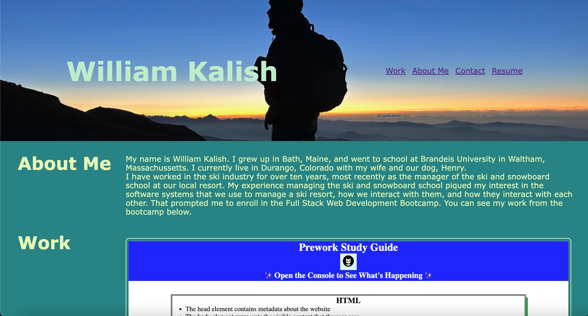

#William Kalish Portfolio

##Description
This project serves as a portfolio of a web development bootcamp student's work during the class. The purpose is to highlight various projects throughout the bootcamp so that potential employers can easily view the student's work. The project is also an opportunity to showcase CSS and all of the properties learned in Module 2.

##Landing Page Preview
View the live website:

And a preview of the landing page:

##License
Please refer to the LICENSE in the repo.

###Contributors
Made with care by William Kalish
With help from the entire cohort in the DU FullStack Bootcamp
Includes icons from www.fontawesome.com
Colorway from khroma.co